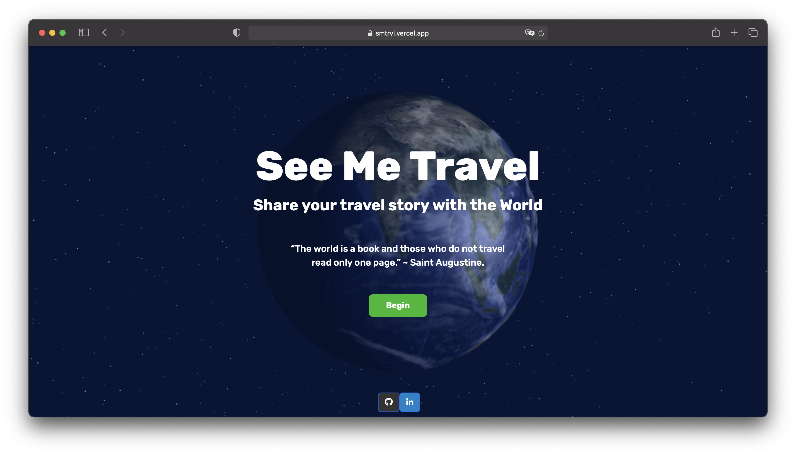

<div align="center">
  
</div>
<h1 align="center">
  🇰🇿 See Me Travel 🇰🇿
</h1>
<p align="center">
  Hosted with <a href="https://www.vercel.com/" target="_blank">Vercel</a>
</p>



## Want to run on your machine? 💻

1. Clone the project

   ```sh
   git clone https://github.com/kappassov/SeeMeTravel.git
   ```

1. Install the dependencies

   ```sh
   cd SeeMeTravel
   npm i
   ```

1. Start the development server

   ```sh
   npm start
   ```

## Contributing 💁🏽

Feel free to reach me and suggest any improvements ;)
